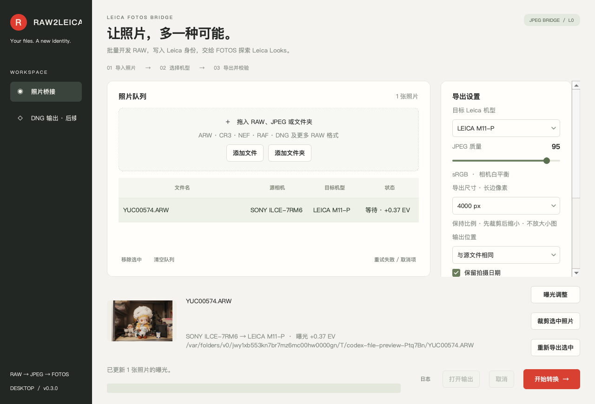
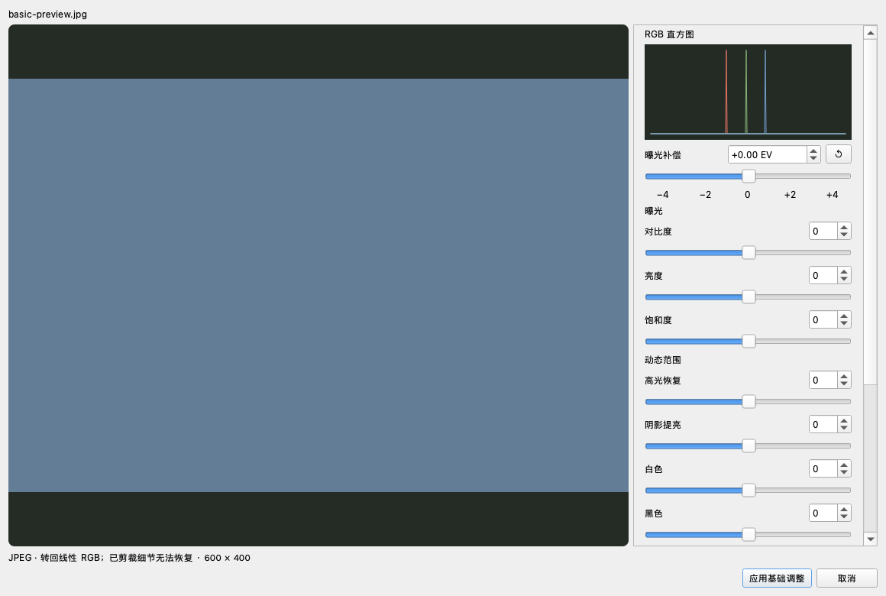

# RAW2LEICA

一个本地桌面照片桥接工具：**RAW / JPEG → 高质量 sRGB JPEG → Leica 身份 EXIF**。
默认目标身份为 `LEICA M11-P`，可切换其他 Leica 机型，用于在 Leica FOTOS 中测试 Leica Looks。照片在本地处理，原文件保持不变。

## 功能概览

| 功能 | 当前支持 |
|---|---|
| 照片桥接 | RAW / JPEG 输入，sRGB JPEG 输出，Leica 身份 EXIF |
| 基础调整 | 曝光、对比度、亮度、饱和度、高光、阴影、白色、黑色 |
| 预览 | RGB 直方图、剪裁警告、未调整原图对比 |
| 裁剪与尺寸 | 常用比例、逐张或批量裁剪、长边限制 |
| 批量处理 | 每张独立参数、相对增减、重试、取消、不覆盖成片 |
| 校验 | JPEG 完整性、EXIF / ICC 回读、逐张 JSON 记录 |

镜头像素矫正和 DNG 输出尚未实现；本工具也不直接应用 Leica Looks。



## 安装与启动

需要 Python 3.11+（推荐 3.13）、ExifTool，以及项目 Python 依赖。macOS 在项目目录执行：

```sh
brew install exiftool
sh scripts/setup.sh
```

安装完成后，双击 **`Launch.command`**，或执行：

```sh
.venv/bin/python -m raw2leica
```

可以同时传入照片或文件夹路径：

```sh
.venv/bin/python -m raw2leica /path/to/photo.ARW /path/to/folder
```

如果 Homebrew 下载失败，也可以在具备 Perl 的机器执行 `.venv/bin/python scripts/install_exiftool.py`，安装固定版本、SHA-512 校验的项目内副本（来源：`exiftool-vendored.pl` npm 包）。该副本不随 Python wheel 打包，许可证保留在 `.tools/exiftool`。

如果系统的 Python 不符合版本要求：

```sh
PYTHON_BIN=/opt/homebrew/bin/python3.13 sh scripts/setup.sh
```

Windows：安装 Python 3.11+ 与 ExifTool，将 `exiftool.exe` 加入 PATH（或设置 `EXIFTOOL_PATH`），然后执行 `python -m venv .venv`、`.venv\Scripts\python -m pip install -e .`、`.venv\Scripts\python -m raw2leica`。Windows 尚未实机验证。

## 使用

1. 拖入 RAW、JPEG 或文件夹，或点击“添加文件”。文件夹递归扫描，自动去重，不跟随目录符号链接。
2. 选择目标身份：M11-P、M11、M11-D、M11 Monochrom、Q3、Q3 43、SL3、SL3-S、M EV1。
3. 设置 JPEG 质量、导出尺寸和输出文件夹；选择是否保留日期、曝光、焦距、GPS。
4. 按需选中照片点击“曝光调整”或“裁剪选中照片”，确认预览后应用。
5. 点击“开始转换”。完成后打开输出目录，将 **JPEG 原文件**传到 iPhone 并在 FOTOS 中测试。

默认输出 `原文件名_Leica.jpg`；重名递增编号，不覆盖任何现有照片。每张 JPEG 配套 `.jpg.json` 校验记录。双击完成的队列条目可打开成片。损坏照片单独报错，不中断批量；可重试失败或取消项。

取消在阶段之间生效。LibRaw 解码与当前 ExifTool 调用不能中途强制终止；等待当前步骤结束后清理未完成输出。已完成的文件保留。关闭窗口也会先安全结束任务。

### 导出尺寸与裁剪

导出长边可选原尺寸、6000、4000、3000、2048 像素或自定义（320–16000）。首次使用默认长边 4000；可改回原尺寸。保持比例，不放大小图；尺寸选择会保存到下次启动。

选中一张照片点击“裁剪选中照片”：后台生成实际 RAW 开发预览，然后拖动四角调整、拖动框内移动，或按住 Shift 拖动重新画框。支持自由、原图比例、3:2 / 2:3、4:3 / 3:4、16:9 / 9:16、1:1。点击“重置裁剪”恢复完整画面。

裁剪按照片保存在当前队列中，关闭程序后不保留队列或裁剪设置。原文件不变；导出报告会记录归一化裁剪范围。多选时可勾选将同一相对范围应用到选中照片；不同画幅的照片可能得到不同的裁剪比例，应逐张检查。

处理顺序为：RAW 开发 / JPEG 读取 → 有效画幅与方向 → 基础调整 → 用户裁剪 → 按长边缩小 → sRGB JPEG 编码 → Leica EXIF。多机型测试也使用同一裁剪和导出尺寸。

已完成的照片若需换尺寸再导出，选中后点击“重新导出选中”，会生成新的编号文件，保留之前的成片。

### 基础曝光调整

选中照片点击“曝光调整”。侧栏分为曝光和动态范围两组，每项都支持滑杆及数值输入；侧栏可滚动，底部提供“重置全部调整”。

| 滑杆 | 范围 | 用途 / 正值方向 |
|---|---|---|
| 曝光补偿 | −4.00 至 +4.00 EV | 增加整体线性曝光量，参数精度 0.01 EV |
| 对比度 | −100 至 +100 | 加强明暗差异，以中灰为中心调整曲线 |
| 亮度 | −100 至 +100 | 主要提亮中间调 |
| 饱和度 | −100 至 +100 | 增强色彩；−100 转为黑白 |
| 高光恢复 | −100 至 +100 | 压低亮部，利用尚未剪裁的数据 |
| 阴影提亮 | −100 至 +100 | 提亮暗部 |
| 白色 | −100 至 +100 | 提亮最亮的色调区域 |
| 黑色 | −100 至 +100 | 提亮最暗的色调区域 |

白色 / 黑色是色调区域控制，不是输入黑白点。控制分类参考 Capture One，范围和处理公式由本项目独立设计，不复现其专有色彩引擎。已丢失的高光、阴影细节不能恢复。

| 操作 | 行为 |
|---|---|
| 曝光方向键 / 滚轮（控件获得焦点时） | 0.1 EV |
| 曝光 Shift + 方向键 | 1 EV |
| 曝光 Alt + 方向键 | 0.01 EV |
| 其余滑杆方向键 / Shift + 方向键 | 1 / 10 |
| Alt + 拖动滑块 | 十分之一灵敏度精调 |
| 双击滑块 | 当前项归零 |
| 曝光旁的 ↺ | 曝光归零 |
| 点击预览后按住 Q 拖动或滚动 | 快速调整曝光 |
| Q + 空格 | 曝光归零 |
| 按住空格 / 勾选对比 | 暂时查看全部基础调整为零的原图 |
| 重置全部调整 | 八项全部归零 |

RGB 直方图和红色高光 / 蓝色阴影警告反映当前裁剪后的预览。首次 RAW 开发需要等待，之后使用缓存更新预览。曝光预览、裁剪预览与最终导出共享调整参数及公式；预览缩小方式与导出不同，细节和剪裁比例可能略有差异。

多选时可选择“统一设值”或“相对增减”，作用于全部八项参数。例如首张曝光 +1.00 改成 +1.30，其余 −0.50 会改成 −0.20；各项超出范围时限制到边界并提示。默认仅修改当前照片。

曝光、基础调整和裁剪按照片保存在当前队列，退出后不保留。调整已完成照片会使其进入等待状态，再次转换生成新的编号文件。输出 JSON 使用 `exposure_ev` 和 `basic_adjustments` 记录调整值，拍摄时的曝光补偿按元数据保留开关处理。



RAW 使用 16 位线性开发与固定中性亮度基准，再进行调整及 sRGB 编码。该基准不是相机厂商色彩配置或 Capture One 自动曝光。新增算法已通过自动测试，真实 RAW 场景的主观画质评估仍待完成。详情见 [曝光设计与来源](docs/exposure-design.md)。

### 镜头元数据与矫正状态

**当前只处理镜头 EXIF，没有执行畸变、暗角或色差的像素矫正。** 原 RAW 即使含有厂商校正参数，当前开发流程也不会应用。需要校正时，先在支持该 RAW 的开发软件中完成校正，导出 sRGB JPEG 后导入本工具。接入方案见 [镜头校正说明](docs/lens-correction.md)。

- **兼容模式**：写入 Leica LensMake，不保留原始 LensModel / LensInfo；勾选曝光时保留真实光圈和焦距。
- **保留真实镜头**：额外保留原镜头型号和规格。
- **移除镜头信息**：不写镜头品牌、型号和规格；曝光/焦距由单独开关控制。

### 同图多机型测试

选中一张照片，点击“同图多机型测试”，一次生成 M11-P、M11、Q3、Q3 43、SL3、M EV1 六份 JPEG。基图只开发和压缩一次，六份输出只改变身份元数据，像素一致。测试途中取消或失败时，之前已完成的变体会保留在输出目录。

## 处理方式

- rawpy / LibRaw 完整开发 RAW，不使用内嵌 JPEG 代替 RAW 解码。
- 相机白平衡、AHD 去马赛克、16 位线性开发、固定中性亮度参考、曝光增益与基础色调 / 饱和度调整、标准 sRGB 编码、JPEG 4:4:4。
- 应用相机默认有效裁切与照片方向；输出 Orientation=1，避免再次旋转。
- JPEG 输入按方向处理，有 ICC 时转换到 sRGB，再以选择的质量重新编码。
- 新建 JPEG，只按白名单复制 EXIF 拍摄参数，排除源相机软件、MakerNote、序列号和厂商修正数据。
- 回读验证身份、图像尺寸、方向、保留字段、隐私开关及 ICC，并检查 MakerNote / C2PA 元数据。
- 一个后台转换线程串行开发，控制多张大 RAW 同时解码的内存；导入与预览也在后台。

`✓ EXIF 已校验` 表示文件和元数据校验通过，**不代表已自动验证当前版本 FOTOS 的识别或 Looks 可用性**。此前 Q3 测试成功来自用户实测；其他身份需用 App 测试。Monochrom 选项仅改变身份，不将照片转成黑白。

## 项目结构

```text
raw2leica/core.py      转换、元数据白名单、验证、同图测试
raw2leica/app.py       PySide6 界面和后台任务队列
raw2leica/exposure.py  基础调整控件、缓存预览、直方图与快捷操作
raw2leica/imaging.py   预览 / 导出共享线性开发与基础调整
raw2leica/crop.py      裁剪预览、比例与交互
raw2leica/profiles/    独立 JSON 机型配置
raw2leica/assets/      界面图标
tests/                转换行为及界面任务流程测试
docs/                 界面截图与验证记录
```

配置与批次日志存放于 Qt 的用户配置/应用数据目录，可点击“日志”查看具体路径。逐张校验记录与照片一起导出，包含所选保留的元数据（包括启用的 GPS）。

## 验证与边界

```sh
.venv/bin/python -m pytest -q
```

当前 34 项自动测试通过，覆盖转换、基础调整、批量参数、裁剪及界面流程。历史 RAW 样本验证与新增算法的主观画质评估分开记录。

接受 ARW / CR3 / CR2 / NEF / RAF / RW2 / ORF / PEF / 3FR / DNG 等扩展名；具体相机是否可解码由当前 LibRaw 决定，不能仅凭扩展名保证支持。实测范围见 [验证记录](docs/validation.md)。

当前实现 JPEG 桥接、导出尺寸、逐张裁剪与八项基础调整，DNG 作为输入；**尚未实现 DNG 输出**。不模拟传感器数据、Leica MakerNote、序列号或 C2PA 签名。不应用 Leica Looks 本身。未进行 500 张压力测试或 Windows 打包发布。

开发参考：[rawpy 官方 API](https://letmaik.github.io/rawpy/api/rawpy.RawPy.html)、[ExifTool](https://exiftool.org/)。
